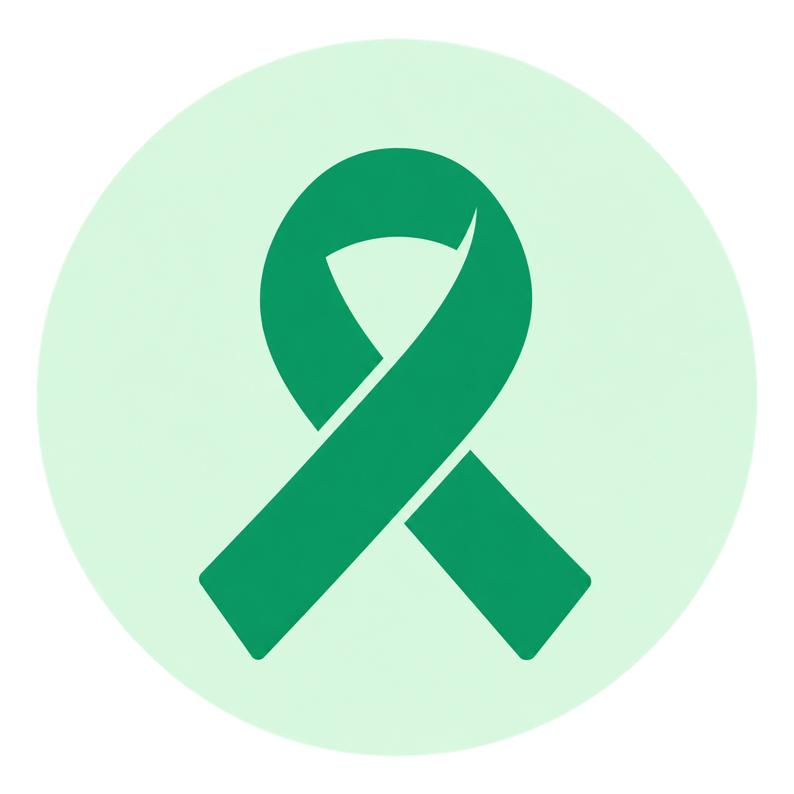
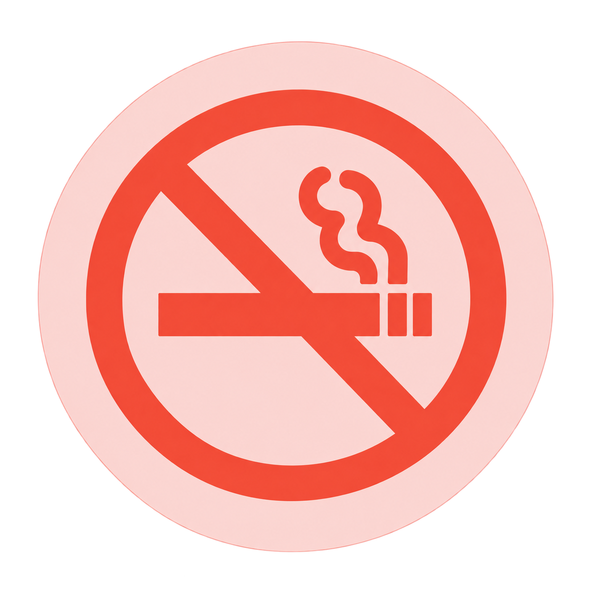
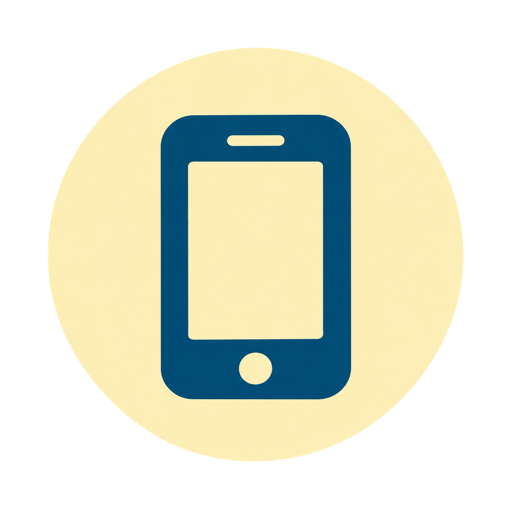
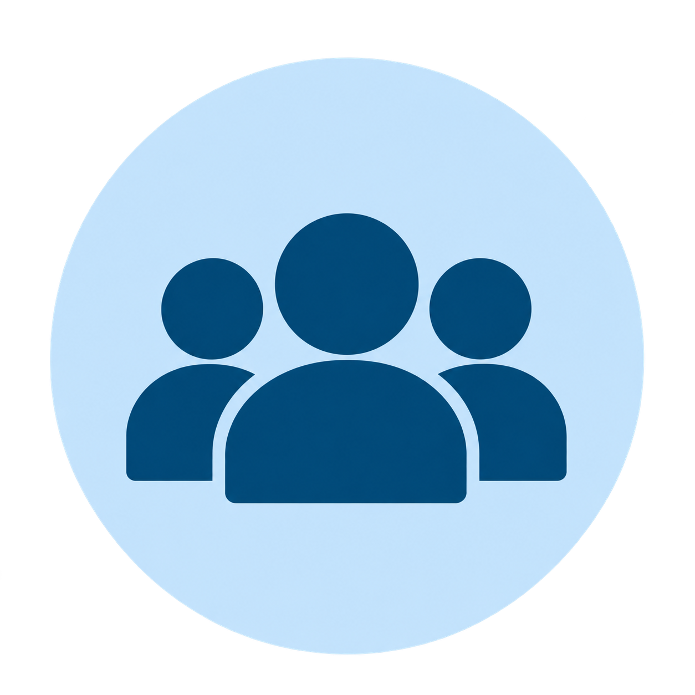
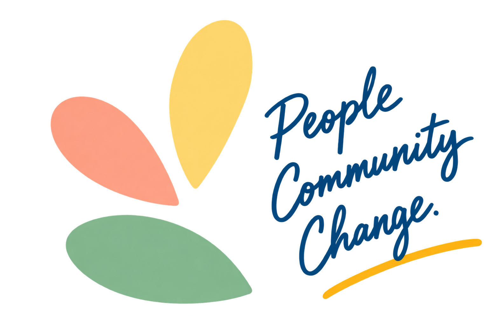

```{=html}
<section class="home-hero">
  <div class="home-container hero-layout">

    <div class="section-text">
      <p class="section-label">WHO WE ARE</p>
      <h2>Working with communities for healthier lives.</h2>
      <p>MOMENT (Mobile, Optimized, and Momentary Interventions for Health Equity) is a research initiative started by researchers at the LSU Health Sciences Center New Orleans. We work with communities to better understand the health challenges people face in everyday life and to develop practical ways to support them.</p>
      
      <a class="home-button" href="projects.qmd">Learn More →</a>
    </div>

    <div class="hero-image">
      
    </div>

  </div>
</section>


<section class="home-mission">
  <div class="home-container mission-layout">

    <div class="mission-heading">
      <p class="section-label">OUR MISSION</p>

      <h2>
        Our goal is simple:
        <span style="color: #ff795f; display: inline; font-size: inherit;">to provide the right support at the moment you need it.</span>
      </h2>
    </div>

    <div class="mission-copy">
      <p>
        By bringing together community members, healthcare providers, local organizations, and researchers, we aim to improve cancer prevention and care and help people live healthier lives. We use community input, health communication, and digital tools to make support easier to access, more personal, and more responsive.
      </p>
    </div>

  </div>
</section>

<section class="home-focus">
  <div class="home-container">

    <p class="section-label">WHAT WE FOCUS ON</p>
    <h2></h2>

    <div class="focus-grid">

      <div class="focus-item">
        <div class="focus-icon icon-green">
          
        </div>
        <h3>Cancer Screening & Early Detection</h3>
        <p>We connect people with free at-home screening kits and provide timely navigation.</p>
      </div>

      <div class="focus-item">
        <div class="focus-icon icon-coral">
          
        </div>
        <h3>Tobacco Cessation</h3>
        <p>We develop personalized approaches to help people quit smoking and stay smoke-free.</p>
      </div>

      <div class="focus-item">
        <div class="focus-icon icon-yellow">
          
        </div>
        <h3>Digital & Personalized Support</h3>
        <p>We use digital technology to understand people’s changing needs and provide the right support at the right moment.</p>
      </div>

      <div class="focus-item">
        <div class="focus-icon icon-blue">
          
        </div>
        <h3>Health Education & Communication</h3>
        <p>We provide culturally relevant health education workshops to help people understand their options, make informed decisions, and take action for their health.</p>
      </div>

    </div>
  </div>
</section>

<section class="home-involved">
  <div class="home-container involved-layout">

    <div class="section-text">
      <p class="section-label">GET INVOLVED</p>
      <h2>Want to work with us?</h2>
      <p>We welcome students, researchers, healthcare professionals, organizations, and community members who are interested in working with us to improve cancer prevention and care. We are also interested in participating in community events, health fairs, outreach activities, and local programs where we can connect with residents, share health information, and learn directly from the community.</p>
      
      <p>Interested in joining MOMENT, partnering with us, or inviting our team to a community event? Get in touch with us.</p>

      <a class="home-button" href="contact.qmd">Get Involved →</a>
    </div>

    <div class="involved-image">
      
    </div>

  </div>
</section>
```